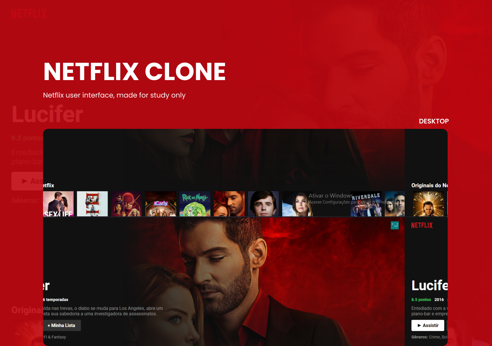

<h1 align="center">
    
</h1>

<br>

## 🧪 Technologies

This project was developed using the following technologies:

- [React](https://reactjs.org)
- [The Movie Database](https://www.themoviedb.org/)

## 🚀 Getting started

Clone the project and access the folder.

```bash
$ git clone https://github.com/dev-gomes/netflix-clone.git
$ cd netflix-clone
```

Follow the steps below:
```bash
# Install the dependencies
$ npm install

# Start the project
$ npm start
```
The app will be available for access on your browser at http://localhost:3000

## 📝 License

This project is licensed under the MIT License. See the [LICENSE](LICENSE.md) file for details.

---

<p align="center">Made with 🧡 by Gomes</p>